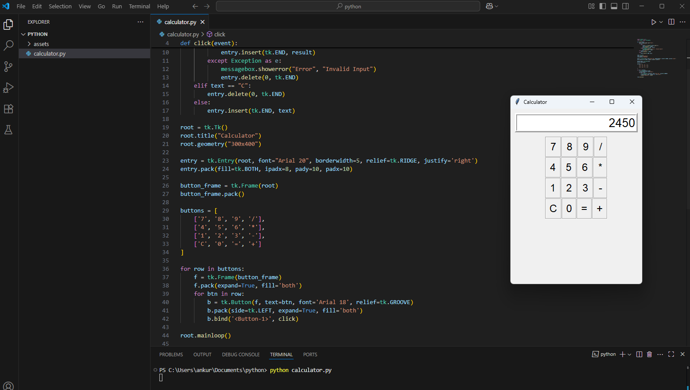

# 🧮 Tkinter Calculator
A simple GUI-based calculator application built using **Python** and **Tkinter**. 
This project is part of a Python course assignment covering **Modules 10 & 11**, which focus on GUI development with Tkinter.

## 🚀 Features
- Perform basic arithmetic operations:
  - Addition (+)
  - Subtraction (-)
  - Multiplication (*)
  - Division (/)
- Clear input with a "C" button
- Real-time display of input and results
- Error handling for invalid inputs (e.g., division by zero)
- Responsive button layout using frames and pack geometry

## 🛠️ Tech Stack
- **Language:** Python 3 
- **Library:** Tkinter (Standard GUI library in Python)

## 🖼️ UI Preview  
> 

